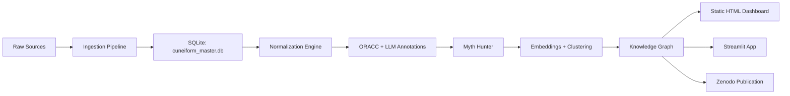

# 🏛️ OX-Stealth Myth Hunter

> **Digital Humanities Pipeline** voor spijkerschrift: van ruwe tabletten → genormaliseerde transliteraties → AI-gedreven motief/entiteit extractie → kennisgraaf → interactieve dashboards → citeerbare publicatie (Zenodo DOI).

## ✨ Features

- **Multi-bron ingestie**: CuneiML (Zenodo), HuggingFace Datasets, CDLI (extensieerbaar)
- **ORACC-normalisatie**: Unicode → ASCII, canonieke tekenconventies
- **LLM-gestuurde analyse**: Few-shot `meta-llama/llama-3.1-70b-instruct` via OpenRouter voor lemmatisatie, taaldetectie, motieven, entiteiten
- **Cross-linguale alignement**: SBERT embeddings (multilingual) → cosine similarity ≥ 0.78
- **Thematische clustering**: Greedy/HDBSCAN op embedding-ruimte
- **Kennisgraaf export**: GraphML, Neo4j Cypher, Cytoscape.js
- **Publicatie-klaar**: Static HTML dashboard, Streamlit app, DataCite/Zenodo metadata
- **Productie-hardening**: Ruff, Black, MyPy, Bandit, Pytest, Pre-commit, GitHub Actions CI/CD

## 📊 Resultaten (voorbeeld)

| Metric | Waarde |
|--------|--------|
| Tabletten in corpus | ~500+ |
| Genormaliseerde transliteraties | ~480 |
| Gemiddelde LLM confidence | 0.87 |
| Cross-linguale alignementen | ~1.200 |
| Thematische clusters | 12–15 |
| Entiteiten (uniek) | ~350 |

## 🏗️ Architectuur

## 📖 Documentatie

👉 **[https://signumcore.github.io/ox-stealth-myth-hunter/](https://signumcore.github.io/ox-stealth-myth-hunter/)**

## 🤝 Bijdragen

Zie [CONTRIBUTING.md](CONTRIBUTING.md) — we volgen Conventional Commits & DCO.

## 📄 Licentie

CC-BY-4.0 — vrij te gebruiken, aanpassen, delen met attributie.